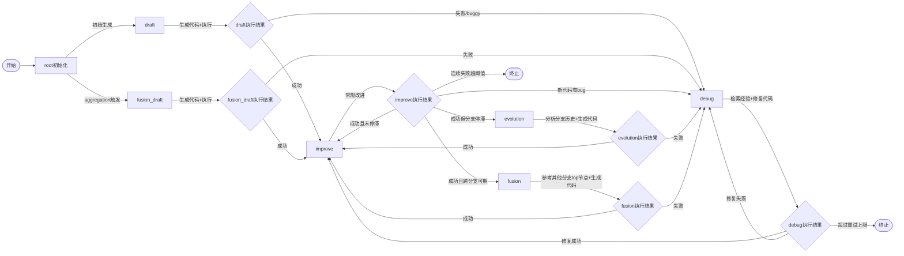

MLEvolve介绍
基于MCTS的结合探索与利用的，并带着知识库作为全局记忆的，一个自动机器学习框架
动作空间及状态机如下

`root`, `draft`, `fusion_draft`, `improve`, `debug`, `evolution`, `fusion`

复现成果：
在lite数据集上，用minimax实现了奖牌率67%，并进行了记忆模块的消融，发现奖牌率下降至了33%，说明记忆模块非常重要。

复现发现的问题：

1. 大家都在用很强的大模型，如果要打榜，harness相同的情况下，minimax比gemini pro overall落后了10%个点。使用gemini会有网络/费用等问题。需要权衡费用和模型的选型。
2. 官方规定一个任务耗时24h，取3次误差。资源要求约等于1/4个A100，意味着A100全占我也只能起4并发。而lite任务有22个*3 / 4 = 16.5天，全部数据集要求高达 80 * 3 / 4 = 60天。这几乎不可承受。因此需要权衡下一步是继续打榜/部分打榜，还是转向落地。

未来需要考虑的功能：

1. 人在回路，需要切入该框架，让人可以干预这个MCTS/轨迹
