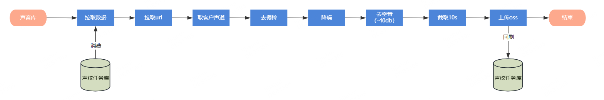

# 声纹算法高度并行推理优化实践报告

## 引言
面对声纹识别批处理任务的严峻时限压力，待处理样本量较预期翻倍，现有计算资源无法满足按期交付要求。本文基于分治思想，通过系统性的并行优化策略，最终实现了35倍性能提升，为大规模AI推理任务提供了完整的优化方案。

## 核心问题：处理速度不够快

基于分治思想，将复杂的性能问题分解为三个子问题：

### 子问题1：计算资源不够
- **解决方案**：增加机器，异构资源分配
- **结果**：机器数量翻4倍，处理速度也翻4倍

### 子问题2：串行处理对资源的利用率不足
- **解决方案**：流水线并行、取数批处理、多路IO
- **结果**：相同机器资源下，速度提升3倍

### 子问题3：单节点处理速度慢导致流水线拥堵
- **解决方案**：针对卡点进行优化，根据CPU数量设计最合适的并行度
- **结果**：相同机器资源下，速度提升2倍

---

## 预处理阶段：渐进式优化实践

### 阶段一：核心瓶颈突破（降噪模型优化）

**痛点**：降噪模型无法批处理，成为整个流程瓶颈

**方案探索路径**：
1. **批处理优化** → 音频长度不一致导致padding耗时增加 → 放弃
2. **GPU + fork并行** → ModelScope显卡锁定限制 → 放弃  
3. **GPU + spawn并行** → A30显存限制+显卡数量不足 → 放弃
4. **CPU + spawn并行** → 10并行度验证成功 → **采用**

### 阶段二：系统稳定性优化

**痛点**：降噪/下载数据/上传OSS等模块导致任务进程死亡，频繁重启

**解决方案**：针对各个模块进行稳定性优化，增强容错机制

**效果**：不再需要半夜2点重启k8s pod

### 阶段三：整体架构优化（流水线并行）

**痛点**：整个流程资源闲置，对计算资源利用率低

**解决方案**：设计9阶段流水线并行架构，采用生产者-消费者模式



**核心设计**：
- 生产者-消费者模式：每个进程既是前一阶段的消费者，又是下一阶段的生产者
- 流水线处理：9个处理阶段可以同时处理不同的数据项
- 缓冲队列：8个队列提供缓冲，平衡各阶段处理速度差异

**效果**：10万/天 → 36万/天（**3.6倍提升**）


### 阶段四：IO性能优化

**痛点**：取数慢，和OSS交互慢

**解决方案**：
- **数据获取优化**：多线程数据拉取，SQL批处理优化
- **网络传输优化**：带宽拓展，多线程下载，OSS重试机制优化

**效果**：36万/天 → 50万/天（**1.4倍提升**）

### 阶段五：弹性资源扩容

**痛点**：计算资源不足

**解决方案**：5台CPU + 4台A30做CPU用 + 8台112C高性能机器

**效果**：50万/天 → 150万/天 → 350万/天（**7倍提升**）

---

## 单节点性能优化：多维度并行策略

流水线并行后发现数据堵塞在较慢节点，主要瓶颈为模型处理模块、数据获取模块、OSS上传模块。

### 模型并行优化
- **手动拥堵**：根据上游待处理文件数手动拥堵，避免硬盘爆炸
- **并行度优化**：通过实验调整模型并行度大小
- **模型加载优化**：单次加载重复读取，减少处理时长

### 并行度实验结果（固定500条数据）
| 并行度 | 总耗时 | 单位时间吞吐量 | CPU核心数/进程 |
|------|------|------|----------|
| 12 | 490s | 1.02 | 12 |
| 8 | 475s | 1.05 | 18 |
| 4 | 196s | 2.55 | 36 |
| 3 | 126s | 3.96 | **48** |
| 2 | 142s | 3.52 | 72 |
| 1 | 359s | 1.39 | 144 |

**结论**：每个降噪进程分配48个CPU核心时速度达到最大，证明了合理的并行度配置比盲目增加进程数更重要。

### 性能提升效果
- **降噪模型优化**：2.3s/条 → 0.5s/条
- **数据获取优化**：1.5s/条 → 0.04s/条
- **向量化处理**：整体性能提升3倍

---

## 向量化模型优化

### 优化前后对比

**Baseline**：
```python
# 耗时10分钟 -- 痛点所在
for url in df:
   audio = download(url)
   audios.append(audio)

# 耗时2分钟
model(audios)
```

**优化后**：
```python
# 使用多线程，耗时2分钟，局部速度提升5倍
with ThreadPoolExecutor(max_workers=8) as executor:
   audios = executor.map(download, args=(urls,))

# 耗时2分钟
model(audios)
```

**效果**：单pod从100万/天提升到360万/天

---

## 声纹项目并行策略总结

### 最终架构方案
- **预处理**：16台机器流水线并行CPU推理
- **向量化**：4台A30向量化处理

### 并行策略应用
- **数据并行**：38个pod
- **模型并行**：预处理/embedding分离（2个模块）
- **流水线并行**：9阶段流水线处理
- **张量并行**：无
- **专家并行**：无

### 优化成效
- **处理时效**：原35天任务，15天完成，**提效130%**
- **整体性能**：10万/天 → 350万/天，**35倍提升**
- **系统稳定性**：全流程无业务中断，生产安全可控

---

## 从声纹实践到大模型并行策略

声纹项目的成功实践为我们提供了宝贵经验。在大模型领域，并行策略更加丰富和复杂。让我们结合声纹项目的经验，深入探讨大模型训练和推理中的5种核心并行策略。

## 大模型5种并行策略详解

### 1. 数据并行（Data Parallelism）
**定义**：一个模型一台机器上放得下，为了不浪费机器，多放几个模型
**应用**：类似于k8s加节点，部署x个模型负载均衡，推理速度翻x倍
**声纹项目应用**：38个pod实现数据并行

### 2. 模型并行（Model Parallelism）
**定义**：一个模型单台机器/显卡上放不下，按层切分到多台机器/显卡
**应用**：假设模型100层，分两个50层，放在两台机器/显卡上
**声纹项目应用**：预处理和embedding模块分离

### 3. 流水线并行（Pipeline Parallelism）
**定义**：模型并行后填补计算空白，避免资源浪费
**应用**：设计流水线并行填补bubble，提高资源利用率
**声纹项目应用**：9阶段流水线处理架构

### 4. 张量并行（Tensor Parallelism）
**定义**：单层模型一台机器/显卡都放不下，模型每层参数平均划分
**优势**：不需要思考每层大小，自动进行模型分配
**声纹项目**：未使用，但为后续大模型部署提供思路

### 5. 专家并行（Expert Parallelism）
**定义**：专门针对MoE模型的张量并行策略
**应用场景**：大规模MoE模型的高效部署
**声纹项目**：未使用，但理解其在大模型中的重要性

## DeepSpeed ZeRO系列对比

### ZeRO-0：标准数据并行
- 多个模型多个副本

### ZeRO-2：优化数据并行
- 多个模型多个副本，但优化器和状态只有一份
- 只通信模型参数，优化器状态和梯度参数分片

### ZeRO-3：极致数据并行
- 多个模型一个副本，全模型参数分片
- 只通信模型参数

### 大模型部署示例
**部署两个vllm的qwen-232b：**
- 数据并行：2
- 张量并行：4
- 专家并行：可选

---

## 声纹算法效果验证

### 模型选型对比

#### EER性能对比
| 数据集 | CAM(%) | CAM_ZH_EN(%) | ECAPA(%) |
|--------|------------|------------------|--------------|
| VoxCeleb | 7.38 | **1.16** | 2.29 |
| CN-Celeb | **6.05** | 7.87 | 19.02 |
| 业务数据集 | 16.9 | **15.66** | 19.24 |

#### 降噪效果对比
| 数据集 | 降噪前EER(%) | 降噪后EER(%) |
|--------|-------------|-------------|
| 业务数据集 | 27.5 | **16.9** |

---

## 弹性算力资源调配实践

### 场景
声纹识别批处理任务面临严峻交付时限，实际样本量较预期翻倍，需紧急扩容至原有规模2倍。

### 关键操作
1. **资源交付与配置(day1)**：8台机器并入集群，配置系统及网络
2. **应用适配与扩容(day2)**：检查并行度设置，计算最大扩容副本数，执行K8s扩容
3. **资源回收(15天后)**：缩容至原规模，确认无任务残留后下线

### 扩容效果
- 8台机器共112C，单Pod需32C → 最大新增24Pod
- 原15Pod → 扩容至33Pod，按75%算力增长
- 成功在规定时间内完成任务交付

---

## 总结与最佳实践

### 核心经验
1. **分治思想是关键**：将复杂问题分解为可管理的子问题
2. **渐进式优化策略**：从瓶颈突破到整体架构，再到细节优化
3. **并行度平衡至关重要**：需根据具体场景权衡IO与计算并行度
4. **弹性扩容机制**：为应对突发性能需求提供有效解决方案

### 通用原则
- **资源利用最大化**：通过合理的任务分解和资源配置
- **系统稳定性优先**：在性能提升的同时确保生产安全
- **数据驱动决策**：通过实验验证找到最优配置

### 大模型启示
声纹项目的并行实践为大模型训练和推理提供了宝贵经验，5种并行策略的灵活组合将是未来大规模AI系统的核心竞争力。通过系统性的并行优化，我们不仅能够突破性能瓶颈，更能为AI技术的规模化应用奠定坚实基础。